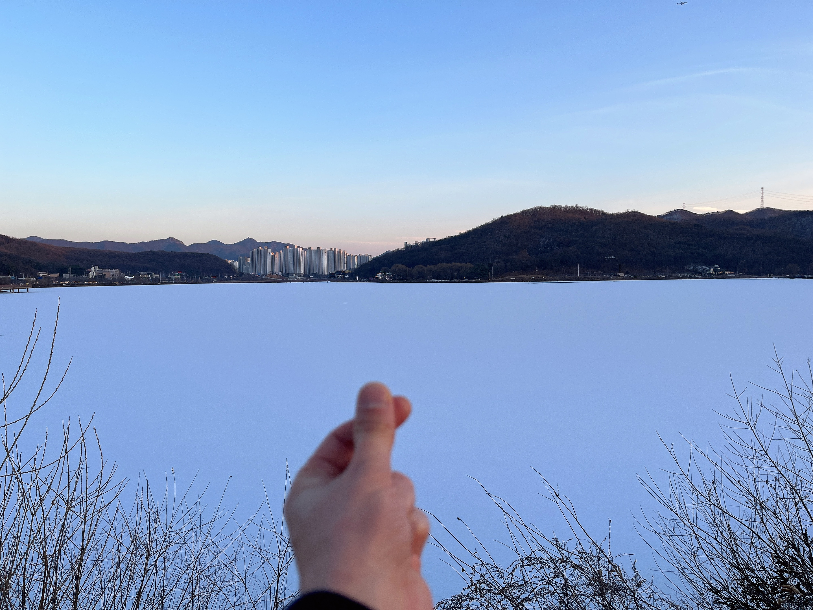

### Introduction

2030-2080년을 살아갈 준비 기간으로 스스로 7년을 잡았다. 그래서 지난 일 년을 회고하며 마무리하고 새로운 계획과 다짐으로 도전하고 싶었다.

### Main

#### Throne: Word, Worship, Prayer, Evangelism

... (무기력, 무능, 게으름, 습관, 원동력, 힘)

#### Career: Robot, Software, Skill, Language

https://yona.naverlabs.com/seungin.cha/roadmap/issue/14

#### Fitness

> 건강을 지키는 건 결국 습관이다. 매일의 불규칙한 일상에 무뎌져 몸이 서서히 약해지고 망가져가도록 놔두지는 말아야겠다. 내 몸을 챙기는 것 뿐만 아니라 아내와 사랑하는 딸도 생각해서 `건강한 습관`을 길들이는 걸 도전해봐야겠다. 관련 책도 좀 읽고 실천해보고 계획도 세워보고. 운동이 습관이 되고 두통이 점차 사라지고 건강한 밥상을 차려먹는 새해가 되길.

##### 간헐적 운동

Zepp 앱을 사용하며 한두 달 정도 꾸준히 운동하는 시기도 있었다. 하지만 흐지부지되기 일쑤였고 재미있는 운동을 하면 나을까 싶어 혼자 농구를 해보거나 탁구 강습을 받아보기도 하고, 쉽게 할 수 있으면 열심히 할까 싶어 스트레칭을 시도해보기도 헀지만 결과적으로 지속하기는 어렵다는 결론을 내릴 수 밖에 없겠다. 어떻게 하면 운동을 지속할 수 있을까? 그 전에 나는 왜 운동을 하려고 하나? 왜 건강해져야 하지?

##### 규칙적 두통

내 기억상으로는 LG를 나오기 1년 전부터 두통이 종종 있어왔는데, 랩스로 오면서부터 스트레스가 많이 줄었고 두통도 나아졌었다. 그런데 올해는 또 다시 한 달에 2-3회씩은 규칙적으로(?) 두통이 발생한 것 같다. 통증이 너무 심할 때는 신경과를 찾지 않을 수 없었지만 원인을 알기 어렵다며 진통제를 얻고 돌아와 넘기는 게 태반이었다. 사내 병원에도 많이 방문했는데 긴장성 두통일 거라는 소견을 받고 물리 치료를 받으며 나아지는 듯도 했었다. 혹여나 문제가 있을까 싶어 뇌혈류 초음파 검사까지도 해봤지만 별다른 단서는 찾지 못했고 편두통일 거라고 했다. 별다른 해답을 찾진 못했지만 이걸로 오히려 스스로 결론을 냈다. 이건 심각한 문제가 아니라 여기에서 무언가 내가 발견하고 찾을 게 있겠구나. 하나님 계획이 반드시 있겠다. 새해에는 이걸 찾아볼 생각이다.

##### 결식의 민족

아내의 임신과 출산에 함께 있는 시간을 많이 가지고 싶어 비교적 재택을 많이 했다. 회사에서 제공해주는 점심과 저녁밥을 매일 직접 차려 먹어야 하다보니 조금은 해먹기도 했지만 아무래도 많은 경우 배달 음식을 시켜먹게 되고 그다지 건강하지 않은 음식이 대부분이었던 것 같다. 하임이 탓은 아니지만 육아로 인한 불규칙적인 생활로 끼니를 거를 때도 많았고 식사 시간도 대중이 없었다. 시간까지 맞추긴 어렵더라도 새해에는 하루 한 끼 식단을 만들어볼 필요도 있을 것 같다. 건강해지는 데는 운동보다 먹는 게 중요하니까.

#### Finance: Money

... (가계부, 자산, 주식, 증여, 주택, 성과, 경제 계획)

#### Relations & Role: Family, Friends, LayLeader

... (남편, 아빠, 아들, 친구, 중직자)

### Conclusion
